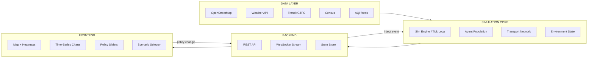

# Urban Intelligence Platform — Project Specification

> **Working title.** The team should rename this once a city and identity are chosen. Suggested directions: a Sanskrit/Hindi-rooted name tied to movement, flow, or city (`Sanchar`, `Nagar`, `Pravaah`), or a neutral English platform name (`Pulse`, `Civic`, `Strand`).

---

## 0. Document Purpose

This document is the **single source of truth** for the project. It is written so that:

- A new team member can onboard in one sitting.
- An AI coding agent (Claude Code, Cursor, etc.) can be handed this document plus a subsystem name and produce useful work.
- Reviewers, professors, or external collaborators can understand scope, ambition, and constraints without asking 20 questions.

**Read order for first-time readers:** sections 1 → 3 → 4 → 5 → 12, then the subsystem you'll work on.

**Read order for AI agents:** section 21 first (it tells you how to behave on this codebase), then the subsystem-specific section.

---

## 1. Project Identity

| Field | Value |
|---|---|
| Working title | Urban Intelligence Platform (UIP) |
| One-line description | A modular urban simulation engine that models how an Indian city responds to climate stress, transport changes, and policy interventions. |
| Project type | Agent-based simulation + interactive dashboard |
| Team size | 7 |
| Status | Pre-build (specification phase) |
| Primary deliverable | Web-based simulation dashboard with policy controls |
| Secondary deliverable | Technical paper / research report documenting methodology and findings |

---

## 2. Vision and Build (the deliberate gap)

This project operates on **two parallel documents**: a north-star vision and a concrete build target. They are not the same. Mixing them up is the most common failure mode for projects like this.

### 2.1 Vision (north star)

A "Mini Earth Simulator" — a modular platform that can eventually simulate:

- Economic dynamics (markets, employment, prices)
- Transportation and mobility
- Climate stress and disaster response
- Human movement and migration
- Energy consumption
- Disease spread

This is what you put in the pitch deck, the README header, and the paper's "future work" section.

### 2.2 Build (what actually ships in v1)

A single-city urban simulation focused on:

- **Commuter behavior** under varying conditions
- **Transport network** (roads + metro + bus)
- **One climate stressor** (heavy rainfall / monsoon flooding)
- **Policy experimentation** (the interactive lever)

Everything else is roadmap, not v1.

### 2.3 Why the gap matters

When asked "isn't this just SimCity / isn't this too ambitious?", the team should answer:

> "The platform is a modular urban simulation engine. Our first module handles transport and mobility under climate stress, calibrated against real ridership data. The same architecture extends to economic shocks, disease spread, and energy systems as future modules."

This framing converts ambition into credibility instead of hype.

---

## 3. Core Thesis

The intellectual foundation of this project. Every architectural decision flows from these principles.

### 3.1 Intelligence comes from emergence, not from neural networks

Agents in this simulation do **not** use LLMs or large neural networks for decision-making. They use:

- **Rule-based logic** for simple, deterministic behaviors
- **Utility / discrete-choice models** for decisions with multiple options (mode choice, route choice, timing)
- **Reinforcement learning** selectively, only for system-level optimization (e.g., traffic signal timing)
- **Adaptive state** (memory of past experiences) so behavior changes over time

Believable urban intelligence emerges from thousands of simple agents interacting under shared constraints. This is the lineage of MATSim, UrbanSim, SUMO, NetLogo — not the lineage of ChatGPT.

### 3.2 Feedback loops are the engine of realism

The simulation feels intelligent when state changes propagate causally:

```
heavy rain → road speeds drop → commute time increases →
agents switch to metro → metro crowds → some agents shift schedule →
business hours effectively change → next day's baseline is different
```

No single piece of code "decides" the outcome. The outcome emerges from local rules interacting under global conditions.

### 3.3 The policy lever is the product

What makes this research-grade rather than decorative is the ability for a user to **change the rules of the city and observe the consequences**. Examples:

- Add 20% more bus capacity
- Shut down a metro line
- Raise fuel prices by ₹10/litre
- Declare 30% work-from-home mandate
- Add a new flyover or BRT corridor

The headline interaction is: **"Here is the baseline. Now watch what happens when I change X."**

### 3.4 Visual style: scientific dashboard, not video game

Reference aesthetics: Observable, Our World in Data, NYT data graphics, Bloomberg Terminal, Palantir. **Not** SimCity, Cities: Skylines, or Unity demos. No 3D cinematics, no character animation, no game UI. Maps, heatmaps, time series, sliders, before/after comparisons.

---

## 4. Scope

### 4.1 In scope for v1

| Item | Notes |
|---|---|
| One Indian metro city | TBD — see section 19 |
| Synthetic population of agents | Target: 50k–200k. Start at 10k. |
| Road network from OpenStreetMap | Cleaned with OSMnx |
| Metro + bus network | Static GTFS or hand-coded routes |
| Daily commute cycle | Home → work → home with variation |
| Mode choice | Walk, bike, bus, metro, auto, car |
| Rainfall as a stress event | Affects road speed and mode preference |
| Congestion model | Speed-density relation per road segment |
| Policy interventions | At least 4 sliders working end-to-end |
| Dashboard with live map + charts | Web, browser-based |
| Validation against ≥ 1 real-world metric | E.g., mode share or peak commute time |

### 4.2 Explicitly out of scope for v1

| Item | Why |
|---|---|
| Hydrological flood modeling | Requires DEM data + drainage simulation. Use behavioral response to rain only. |
| Disease spread | Distinct discipline (epi + contact networks). Defer. |
| Full economic markets | Defer; include only cost-of-commute as a thin slice. |
| Real-time 3D rendering | Aesthetic mismatch and engineering cost. |
| LLM-powered agents | Wrong tool. See section 3.1. |
| Multiple cities | Build one well; generalize later. |
| Mobile app | Web only. |
| Agent dialogue / narratives | Not the product. |
| Land use / urban growth dynamics | v2 module. |
| Energy grid simulation | v2 module. |

### 4.3 Hard constraints

- **No agent uses an LLM at runtime.** Period.
- **No proprietary paid datasets.** Open data only.
- **Total cloud spend < ₹10,000** for the v1 demo.
- **Demo must run on a single laptop** with optional cloud assist for compute-heavy training.

---

## 5. System Architecture

### 5.1 High-level diagram



### 5.2 Data flow contract

1. **Data layer** ingests static + dynamic data into a unified geospatial format.
2. **Sim core** loads this on startup, then runs a tick loop independent of external systems.
3. **Backend** exposes sim state via REST (snapshots) and WebSocket (live stream).
4. **Frontend** subscribes to the stream, renders state, and sends policy events back.
5. Policy events are injected into the sim at the next tick boundary.

### 5.3 Technology stack (concrete)

| Layer | Choice | Rationale |
|---|---|---|
| Sim engine | Python + Mesa, with NumPy vectorization for hot paths | Mature ABM library; team knows Python |
| Geospatial | OSMnx, GeoPandas, Shapely | Standard stack |
| Routing | NetworkX (start), igraph or graph-tool if perf demands | Start simple |
| Backend | FastAPI + WebSockets | Async, fast, well-documented |
| Frontend | React + TypeScript + Vite | Standard modern stack |
| Mapping | Mapbox GL JS or MapLibre (open) | MapLibre preferred — no API key dependency |
| Charts | Plotly or D3 + Observable Plot | Plotly for fast wins; D3 for polish |
| State store | In-process dict for v1; Redis if needed | Don't over-engineer |
| Storage | Parquet for sim outputs; SQLite for metadata | No need for Postgres in v1 |
| Deployment | Local + optional Railway/Render for demo URL | Cheap or free |

**Do not introduce:** Kubernetes, Kafka, microservices, Postgres clusters, or anything that requires DevOps expertise the team does not yet have. If a v2 needs them, that's a v2 problem.

---

## 6. Subsystems

Each subsystem has a primary owner, but pairs and cross-cuts are normal. Subsystem IDs (`SUB-01` etc.) are stable references used throughout the codebase and documentation.

### SUB-01: Simulation Engine

**Owner:** Person 1 (paired with Person 2 during weeks 1–4)
**Purpose:** Run the discrete-time simulation loop, manage world state, schedule agent updates, inject events.

**Inputs:**
- Initialized agent population
- Loaded transport network
- Scenario configuration (rain intensity, policy state, etc.)
- Event queue (from API)

**Outputs:**
- World state snapshot at every tick
- Agent trajectories
- Aggregate metrics per tick

**Key responsibilities:**
- Define `Tick` semantics (one tick = N minutes of simulated time; default N = 5)
- Maintain global clock and calendar (day of week, hour)
- Apply environmental state (weather, time of day, holidays)
- Schedule agent activations (not every agent every tick; use priority queue)
- Emit snapshots for the backend

**Tech:** Python, Mesa, NumPy. Profile early; convert hot loops to vectorized NumPy or Numba if tick rate drops below target.

**Performance target:** 10,000 agents at 1 tick/sec on a laptop for v1. 100,000 agents on cloud GPU/CPU for v2.

### SUB-02: Agent Behavior Model

**Owner:** Person 2 (paired with Person 1 during weeks 1–4)
**Purpose:** Define how individual citizens make decisions.

**Inputs:**
- Agent personal attributes (income, home, work, household, transport access)
- World state (time, weather, network conditions)
- Personal memory (recent experiences)

**Outputs:**
- Per-agent decisions: when to leave, which mode, which route, whether to cancel/defer

**Key responsibilities:**
- Implement the **utility function** for mode choice (see section 7)
- Implement **daily activity schedules** (when does the agent leave home, return)
- Implement **memory and adaptation**: agents update preferences based on outcomes
- Tune utility weights to produce realistic mode shares

**Tech:** Python, NumPy. Optional later: scikit-learn for fitting discrete choice models against survey data.

### SUB-03: Transportation & Routing

**Owner:** Person 3
**Purpose:** Represent the road and transit network; compute travel times under varying conditions.

**Inputs:**
- OSM-derived road graph
- Metro and bus network definitions
- Per-segment congestion state
- Weather state (affects road speeds)

**Outputs:**
- Shortest-path queries (time-weighted)
- Per-segment travel times
- Per-vehicle/per-station occupancy

**Key responsibilities:**
- Build and clean the multi-modal network graph
- Implement Dijkstra / A* with time-dependent edge weights
- Implement a **congestion model** (start with BPR function, see glossary)
- Track metro and bus occupancy per station / per leg
- Provide a queryable routing service to agents

**Tech:** NetworkX initially; switch to igraph if route queries exceed budget (likely around 50k+ agents). OSMnx for graph construction. GTFS for transit if available.

### SUB-04: Data Engineering

**Owner:** Person 4
**Purpose:** Acquire, clean, and serve all external data feeding the simulation.

**Inputs:**
- OpenStreetMap for the chosen city
- GTFS feeds (metro / bus) if available; else hand-built
- Historical weather data
- Census or population estimates
- AQI feeds (for output overlays, not core simulation)

**Outputs:**
- Cleaned road graph (Parquet / GraphML)
- Synthetic population (Parquet)
- Network definitions (JSON)
- Validation datasets

**Key responsibilities:**
- Pull and clean OSM data (Indian OSM has gaps — budget a full week)
- Generate the synthetic population (see section 9.3)
- Provide validation anchor data (ridership numbers, mode share surveys)
- Document every data source with provenance

**Tech:** Python, Pandas, GeoPandas, OSMnx, Shapely.

### SUB-05: Backend & API

**Owner:** Person 5 — **also serves as integration / DevOps owner**
**Purpose:** Expose simulation state to the frontend; accept policy events; manage scenario runs.

**Inputs:**
- Sim state from SUB-01
- Policy events from UI

**Outputs:**
- REST endpoints (scenario list, snapshot fetch, metric queries)
- WebSocket stream (live tick updates)
- Event injection back to sim

**Key responsibilities:**
- Design API contracts (OpenAPI spec maintained in repo)
- Implement WebSocket fan-out
- Manage scenario lifecycle (start, pause, reset, branch)
- Own CI/CD, deployment, branch protection
- Maintain integration health — run a daily end-to-end smoke test

**Tech:** FastAPI, uvicorn, websockets.

### SUB-06: Frontend & Visualization

**Owner:** Person 6 (consider pairing for design-heavy weeks)
**Purpose:** Render the simulation legibly and let users interact with policy levers.

**Inputs:**
- WebSocket stream from SUB-05
- User interactions

**Outputs:**
- Map view with agent density, congestion, weather overlay
- Time-series charts (commute time, metro load, mode share)
- Policy sliders + scenario selector
- Before/after comparison view

**Key responsibilities:**
- Build the dashboard layout (map dominant, side panel for controls, chart strip at bottom)
- Implement heatmap rendering (deck.gl or Mapbox native layers)
- Implement playback controls (pause, scrub, speed)
- Maintain the design system: typography, palette, spacing
- Avoid out-of-the-box Material / Bootstrap aesthetics

**Tech:** React + TypeScript + Vite, MapLibre GL JS or Mapbox GL JS, deck.gl for heavy overlays, Plotly or D3 for charts. Tailwind for styling but with a custom palette.

**Design references (load these as visual canon):** Observable Plot, Our World in Data, ECMWF weather dashboards, FlowingData, recent NYT interactive features.

### SUB-07: Research, Metrics & Validation

**Owner:** Person 7
**Purpose:** Make the project research-grade rather than demo theater.

**Inputs:**
- Sim outputs
- Real-world validation data

**Outputs:**
- Validation report (sim vs reality)
- Experiment log (scenarios run, parameters, results)
- Architecture diagrams
- Final paper / technical report
- README and developer documentation

**Key responsibilities:**
- Define **anchor metrics** in week 1 (see section 11)
- Run experiments systematically (not ad-hoc)
- Maintain a decision log (why we chose X over Y)
- Produce all written artifacts: paper, presentation, GitHub README, architecture diagrams
- Coordinate with Person 5 on reproducibility (seeds, scenario configs)

**Tech:** Markdown, LaTeX (optional), Mermaid, Jupyter for analysis notebooks.

---

## 7. Agent Model (detailed)

### 7.1 Agent attributes

Every agent carries the following state:

```python
@dataclass
class Agent:
    id: int
    home_node: NodeID         # location in road network
    work_node: NodeID | None  # None for non-workers
    income_bracket: int       # 1-5 (low to high)
    age: int
    household_id: int
    has_car: bool
    has_bike: bool
    has_metro_pass: bool
    schedule: ActivitySchedule  # when they typically move
    memory: AgentMemory         # recent commute experiences
    current_state: AgentState   # AT_HOME | COMMUTING | AT_WORK | etc.
    current_mode: Mode | None
    current_route: list[NodeID] | None
```

### 7.2 Decision function (mode choice)

Agents choose among available modes using a **utility function**. This is a standard discrete choice (multinomial logit) approach:

```
U(mode) = β_time * travel_time
       + β_cost * monetary_cost
       + β_comfort * comfort_score
       + β_weather * weather_penalty
       + β_habit * habit_bonus
       + ε
```

Where:
- `β_time` is negative (more time = less attractive)
- `β_cost` scales with income (poor agents weight cost more heavily)
- `β_weather` applies penalty to walk/bike when raining heavily
- `β_habit` rewards modes the agent has used successfully recently
- `ε` is a Gumbel-distributed random term

Choice is `argmax(U)` over available modes (softmax-sampled if we want stochasticity).

**Initial weights are guesses.** They must be calibrated against real mode share (see section 11). Plan for at least one calibration pass per major scenario.

### 7.3 Daily activity schedule

Each agent has a schedule with some randomness:

- Wake / leave home: drawn from a distribution centered on demographic-typical times
- Work duration: 6–10 hours depending on agent type
- Return home: drawn from a distribution
- Discretionary trips: small probability per evening (shopping, social)

Schedules adapt: if an agent has had three bad commutes in a row, they may shift their leave time earlier.

### 7.4 Memory and adaptation

Agents do not learn via gradient descent. They learn via simple bookkeeping:

- Track the last N commute outcomes per mode (default N = 10)
- Compute moving averages of time, comfort, reliability
- Update the `habit_bonus` weight based on this

This is enough to produce visible behavior change over a multi-week sim run, without any neural network training.

---

## 8. Simulation Loop

### 8.1 Tick semantics

- 1 tick = 5 simulated minutes (configurable)
- Target wall-clock rate: 1 tick/second at 10k agents for v1
- Sim time is continuous within a tick (events can happen at sub-tick resolution if needed for routing)

### 8.2 Per-tick procedure

```
for tick in run:
    1. advance global clock
    2. update environment state (weather, day phase)
    3. apply any pending policy events
    4. for each agent due for activation:
         agent.observe(world)
         agent.decide()
         agent.act()
    5. update network state (congestion, occupancy)
    6. compute aggregate metrics
    7. emit snapshot to backend
```

### 8.3 Event injection

Policy events (from UI) and scenario events (from config) are injected at tick boundaries:

- `WEATHER_EVENT`: set rain intensity to X for duration D
- `POLICY_EVENT`: change a global parameter (fuel price, bus capacity, etc.)
- `INFRASTRUCTURE_EVENT`: disable a metro line, close a road, add capacity

All events are logged with timestamps for reproducibility.

### 8.4 Determinism and reproducibility

- All randomness flows from a single seeded RNG
- Scenario configs are stored as YAML; a config + seed reproduces a run exactly
- Sim outputs are saved as Parquet with the scenario hash embedded

---

## 9. Data Sources & Pipelines

### 9.1 Required sources

| Source | What we use | Cost | Notes |
|---|---|---|---|
| OpenStreetMap | Road network, POIs, building footprints | Free | Indian OSM has gaps; expect cleanup |
| GTFS feeds | Transit schedules | Free if published | Many Indian cities don't publish GTFS; hand-build if missing |
| IMD / OpenWeather | Historical rainfall, temperature | Free tier | For driving the rain scenario |
| Census 2011 | Population, income, demographics | Free | Use for synthetic population |
| State transport surveys | Mode share validation | Free (sometimes) | Anchor metrics |
| CPCB | AQI overlays | Free | Visual overlay only, not core sim |

### 9.2 Ingestion pipeline

```
raw_data/         # immutable, as-downloaded
  osm/
  weather/
  census/
processed/        # cleaned, joined, ready for sim
  road_graph.parquet
  transit_network.json
  synthetic_population.parquet
  weather_timeseries.parquet
validation/       # ground-truth anchors
  mode_share.csv
  ridership.csv
```

Pipelines are Python scripts in `data/pipelines/`, idempotent, runnable end-to-end with one command.

### 9.3 Synthetic population

Real census data is aggregate. We need individual agents. Approach:

1. Use census tract demographics (age, income, household size distributions)
2. Sample individuals matching tract distributions
3. Assign home locations within the tract
4. Assign workplaces via a gravity model (probability proportional to employment density / distance)
5. Result: a population that matches aggregate stats while having individual variation

This is a well-known technique (iterative proportional fitting). Person 4 owns it.

---

## 10. Demo Scenarios

These are concrete user-facing stories. Each one should be runnable end-to-end and produce a visible "wow" moment.

### Scenario A: "The Monsoon Stress Test" (primary)

**Story:** A normal weekday morning begins. At 8:00 AM sim-time, heavy rainfall begins. Watch the city respond.

**What the user sees:**
- Road congestion heatmap reddens as speeds drop
- Metro ridership chart spikes
- Some metro stations show overcrowding alerts
- Mode-share pie chart shifts from car/bike toward metro/auto
- Aggregate commute time climbs by X minutes

**Policy intervention:** User adds 20% bus capacity mid-scenario. Watch metro overcrowding reduce.

### Scenario B: "Metro Line Shutdown"

**Story:** A major metro line is closed for maintenance. Predict the impact.

**What the user sees:**
- Bus and road congestion on parallel corridors spikes
- Commute times for affected agents increase
- Mode-share shifts

**Policy intervention:** User deploys a "shuttle bus" along the corridor. Watch impact reduce.

### Scenario C: "Fuel Price Shock"

**Story:** Fuel prices rise by ₹20/litre overnight.

**What the user sees:**
- Slow shift in mode share over multiple sim days
- Car-heavy areas show the largest changes
- Metro and bus ridership rise

**Policy intervention:** Compare with and without a fuel subsidy.

### Scenario D (optional, if time permits): "Work From Home Mandate"

**Story:** 30% of office workers shift to WFH.

**What the user sees:**
- Peak congestion flattens
- Aggregate AQI overlay improves (modeled simply, not physically)
- Metro revenue (modeled simply) drops

### The demo narrative

The demo should always follow this arc:
1. **Baseline:** Here is the city on a normal day. (30 sec)
2. **Stress:** Here is what happens under stress event. (1 min)
3. **Intervention:** Here is what happens when we intervene. (1 min)
4. **Comparison:** Here are the metrics, side by side. (30 sec)

This 3-minute arc is what gets practiced for every demo.

---

## 11. Calibration & Validation Strategy

This is the section most student projects skip. Skipping it makes the work indistinguishable from "vibes-based simulation."

### 11.1 Anchor metrics (choose ≥ 2 in week 1)

Examples (city-dependent):

| Metric | Source | Acceptable range |
|---|---|---|
| Peak-hour metro ridership | DMRC/BMRCL/etc. annual reports | ± 20% of real value |
| Mode share for work trips | State transport survey or census | ± 5 percentage points |
| Average peak commute time | Google Mobility / studies | ± 15% of real value |
| Daily ridership per major station | Operator data | ± 25% |

The simulation is **considered baseline-valid** if it matches at least 2 anchors within the acceptable range.

### 11.2 Validation procedure

1. Run the baseline (no events, no policy changes) for 7 simulated days
2. Compute the anchor metrics
3. Compare against real-world values
4. If outside acceptable range, adjust utility weights / network speeds / population distribution
5. Document every adjustment in the decision log

### 11.3 What we don't claim

We do not claim our scenario predictions match reality quantitatively. We claim:

- The baseline matches anchors within stated bounds
- Scenario outputs show **directionally and structurally plausible** responses (e.g., rain causes mode shift toward metro)
- Policy interventions show **relative** rather than absolute effects

Honest framing here is what makes a professor respect the work.

---

## 12. Team Structure

### 12.1 Role assignment

| # | Role | Subsystem |
|---|---|---|
| 1 | Simulation Engine Lead | SUB-01 |
| 2 | Agent Behavior Lead | SUB-02 |
| 3 | Transportation & Routing | SUB-03 |
| 4 | Data Engineering | SUB-04 |
| 5 | Backend + Integration/DevOps | SUB-05 |
| 6 | Frontend & Visualization | SUB-06 |
| 7 | Research, Metrics & Documentation | SUB-07 |

### 12.2 Pairing in early weeks

Persons 1 and 2 **pair-program the core simulation scaffold** for weeks 1–3. After the scaffold exists, they split into their respective subsystem ownership. This avoids the trap of "the engine and the agents are designed independently and don't fit together."

### 12.3 Integration ownership

Person 5 owns:
- Git workflow (trunk-based or short-lived feature branches)
- CI (lint, type check, sim smoke test on every PR)
- Daily end-to-end integration test
- Demo deployment

This is critical. Without a designated integration owner, week 6 becomes merge hell.

### 12.4 Cross-cutting responsibilities

- **Person 7** owns documentation but everyone writes their own subsystem README.
- **All seven** participate in a weekly 30-min sync. Agenda fixed: blockers, integration health, demo-readiness.
- **Person 6** has the final call on visual design; teammates can propose but not veto.

---

## 13. Phased Roadmap

Assumes a ~16-week semester timeline. Compress or expand proportionally.

### Phase 0: Setup (Week 1)
- Pick city (close section 19 item 1)
- Confirm timeline
- Set up repo, CI, project board
- Identify ≥ 2 anchor metrics
- Each person reads this document and writes a 1-page subsystem plan

### Phase 1: Foundations (Weeks 2–3)
- **Goal: vertical slice.** By end of week 3, one agent moves on a real map of the chosen city, visible in a basic browser dashboard.
- This validates the full pipeline: data → sim → API → UI.
- Ugly is fine. Working is the bar.

### Phase 2: Scale and behavior (Weeks 4–6)
- Population scaled to 10k agents
- Mode choice implemented and producing plausible mode shares
- Real road network loaded and routable
- Metro + bus network represented
- Basic congestion model functional

### Phase 3: Scenarios and policy (Weeks 7–9)
- Scenario A (monsoon) running end-to-end
- At least 4 policy levers working
- Time-series and heatmap visualizations in dashboard
- Calibration pass against anchor metrics

### Phase 4: Polish and additional scenarios (Weeks 10–12)
- Scenarios B and C functional
- Dashboard design polished — typography, palette, layout
- Before/after comparison views
- Playback / scrubbing controls

### Phase 5: Research and documentation (Weeks 13–14)
- Run formal experiments (multiple seeds, scenario sweeps)
- Write paper / technical report
- Architecture diagrams finalized
- Demo video recorded as fallback

### Phase 6: Demo prep (Weeks 15–16)
- Demo script rehearsed
- Deployment hardened
- Fallback deterministic demo ready
- Q&A preparation

### Hard rule

**Every week ends with a working build.** No week ends with "we'll have it working next week."

---

## 14. Repository Structure

```
urban-intelligence-platform/
├── README.md                    # Quick start + links into this doc
├── PROJECT_SPEC.md              # This document
├── DECISIONS.md                 # Decision log (Person 7 maintains)
├── pyproject.toml               # Python deps
├── package.json                 # Node deps (top-level workspace)
├── docker-compose.yml           # Local dev orchestration (optional)
│
├── data/
│   ├── raw/                     # Immutable downloads (gitignored, links in README)
│   ├── processed/               # Cleaned outputs (gitignored if large)
│   ├── validation/              # Anchor metric ground truth
│   └── pipelines/               # Ingestion scripts
│
├── sim/                         # SUB-01, SUB-02, SUB-03
│   ├── engine/                  # Tick loop, world state
│   ├── agents/                  # Agent model, decision logic
│   ├── network/                 # Routing, congestion
│   ├── scenarios/               # YAML scenario configs
│   ├── metrics/                 # Metric definitions
│   └── tests/
│
├── backend/                     # SUB-05
│   ├── api/                     # FastAPI routes
│   ├── ws/                      # WebSocket handlers
│   ├── store/                   # State management
│   └── tests/
│
├── frontend/                    # SUB-06
│   ├── src/
│   │   ├── components/
│   │   ├── map/
│   │   ├── charts/
│   │   ├── policy/
│   │   └── styles/
│   └── tests/
│
├── research/                    # SUB-07
│   ├── notebooks/               # Jupyter analyses
│   ├── experiments/             # Experiment configs + results
│   ├── paper/                   # LaTeX or Markdown source
│   └── diagrams/                # Architecture, flow diagrams
│
└── docs/
    ├── architecture.md
    ├── subsystems/              # One file per SUB
    ├── data-sources.md
    └── calibration.md
```

---

## 15. Conventions

### 15.1 Code

- **Python:** Black + Ruff. Type hints required for public APIs. `mypy --strict` on `sim/`.
- **TypeScript:** Strict mode. ESLint + Prettier.
- **Commits:** Conventional commits (`feat:`, `fix:`, `refactor:`, `docs:`, `test:`).
- **Branches:** `main` is always deployable. Feature branches off `main`, merged via PR with ≥ 1 review.
- **Tests:** Every sim module has at least smoke tests. Backend has API contract tests.

### 15.2 Data

- Geospatial coordinates: WGS84 (lat/lon) for storage; project to UTM only for distance calculations.
- Times: UTC in storage, IST in display.
- Currency: integer paise internally, formatted as ₹ for display.
- Identifiers: stable string IDs preferred (`agent_00042`) over raw integers in serialized output.

### 15.3 Naming

- Subsystem IDs: `SUB-01` through `SUB-07`, stable forever.
- Scenarios: named `scenario_a_monsoon`, `scenario_b_metro_shutdown`, etc.
- Metrics: `metric_<name>_v<n>`, version bumped on definition change.

### 15.4 Documentation

- Every subsystem has a README in `docs/subsystems/SUB-XX.md` that mirrors section 6 of this doc but goes deeper.
- All architectural decisions go in `DECISIONS.md` with format: context → options considered → decision → consequences.

---

## 16. Performance & Scaling

### 16.1 Known bottlenecks

| Bottleneck | Mitigation |
|---|---|
| Per-agent Python overhead | Vectorize with NumPy where possible; profile early |
| Route queries dominate | Precompute many-to-one paths; cache aggressively |
| WebSocket fan-out | Throttle update rate; send diffs, not full state |
| Mapbox / deck.gl render | Aggregate to grid cells; don't render every agent |

### 16.2 Performance budget

| Stage | Target |
|---|---|
| 10k agents, 1 sim day, no UI | < 5 minutes wall clock |
| 10k agents, 1 sim day, with live UI | 1 tick / second sustained |
| Snapshot serialization | < 100ms per tick |
| Frontend frame rate | ≥ 30 fps with full overlay |

### 16.3 Escalation path

If we cannot hit budget with Python + NumPy:
1. Profile to find actual hot path (don't guess).
2. Convert hot path to Numba or Cython.
3. If still slow, consider rewriting the inner loop in Rust with PyO3 bindings.

We do not consider full ports to other languages. Python remains the primary language.

---

## 17. Risks & Mitigations

| Risk | Likelihood | Impact | Mitigation |
|---|---|---|---|
| OSM data for chosen city is incomplete | High | High | Budget week 1 entirely for data cleanup; have backup city option |
| Sim runs too slow for live demo | Medium | High | Pre-record a deterministic demo run; profile early |
| Visual design lands generic | Medium | High | Pick visual references early; design review weekly |
| Calibration fails to match anchors | Medium | Medium | Document honestly; report directional results not absolute |
| Integration breaks before demo | Medium | High | Daily smoke test owned by Person 5 |
| Team member drops out | Low | High | Cross-document everything; no one is irreplaceable |
| Scope creep toward "Mini Earth Simulator" | High | High | Re-read section 4 weekly |
| Demo network fails | Low | Critical | Always have a recorded video fallback |

---

## 18. Open Decisions

These must be closed in week 1. Each blocks downstream work.

1. **City.** Delhi (best data, established narrative), Bengaluru (traffic narrative, decent data), Mumbai (flood narrative, brutal network), Kochi (strongest monsoon story, thinner data), other. Recommend Delhi or Bengaluru for safety, Kochi for ambition.

2. **Timeline.** 2-month sprint, single semester (~16 weeks), full year. Determines how much of section 13 actually happens.

3. **Hosting target.** Local-only demo, or deployed at a public URL. Latter adds work but adds credibility.

4. **Map library.** Mapbox (better visuals, requires API key + free tier limits) vs MapLibre (fully open, slightly less polished).

5. **Project name.** Rename from "Urban Intelligence Platform" to something the team likes.

6. **Anchor metrics.** Pick at least 2 from section 11.1 based on chosen city.

---

## 19. Glossary

- **Agent.** A single simulated citizen with attributes and a decision function. Not an LLM agent.
- **ABM.** Agent-Based Modeling. The methodological tradition this project sits in.
- **BPR function.** Bureau of Public Roads volume-delay function. Standard model: `t = t0 * (1 + α(v/c)^β)` where v is flow, c is capacity. We start with α=0.15, β=4.
- **Discrete choice model.** A family of statistical models for choices among alternatives; multinomial logit is the workhorse.
- **GTFS.** General Transit Feed Specification. Standard format for public transit schedules.
- **Mode.** A way of traveling: walk, bike, bus, metro, auto-rickshaw, car.
- **Mode share.** The fraction of trips made by each mode. Key validation target.
- **OSM / OSMnx.** OpenStreetMap and the Python library for working with it.
- **Tick.** One step of the simulation loop. Default 5 simulated minutes.
- **Utility function.** A numerical score an agent computes for each option; higher is more preferred.
- **Vertical slice.** A thin end-to-end implementation that exercises every layer of the stack.

---

## 20. References (canonical reading)

- Epstein & Axtell, *Growing Artificial Societies* — the foundational ABM book
- MATSim documentation — `matsim.org` — the closest real-world analogue to this project
- Helbing, *Social Forces Model* — pedestrian dynamics
- Ben-Akiva & Lerman, *Discrete Choice Analysis* — the canonical reference for mode choice modeling
- Observable Plot examples — design canon for charts
- Our World in Data — design canon for dashboards
- DMRC / BMRCL / MMRC annual reports — for the chosen city's actual numbers

---

## 21. Guidance for AI Agents Working on This Project

If you are an AI agent (Claude, GPT, Cursor, etc.) being asked to work on this project, read this section first.

### Behaviors to adopt

- **Read the relevant subsystem section in full before writing code.** Do not pattern-match.
- **Stay within the subsystem boundaries** defined in section 6. If a task crosses boundaries, surface the dependency rather than silently widening scope.
- **Use the conventions in section 15.** Match the existing style.
- **Add new architectural decisions to `DECISIONS.md`,** not buried in code comments.
- **Prefer the simple option** when in doubt. This codebase optimizes for readability and student-team maintainability, not for cleverness.
- **Write tests for new logic in `sim/`.** Other subsystems should at least have smoke tests.
- **Update the relevant subsystem README** if your change is non-trivial.

### Behaviors to avoid

- **Do not introduce LLM calls into agent decision-making.** This is a hard constraint (section 3.1). If a task seems to ask for it, push back and propose a utility-based or rule-based alternative.
- **Do not add new top-level dependencies** without justifying them in `DECISIONS.md`.
- **Do not generate code that uses paid APIs** unless explicitly authorized.
- **Do not silently expand scope.** If the task as stated requires implementing a system outside section 4.1 (in-scope), stop and ask.
- **Do not use Material UI, Bootstrap, or shadcn defaults** in the frontend (section 6 SUB-06). Custom design system only.
- **Do not assume the city is fixed** unless the codebase already has the city in config. Check `sim/scenarios/` and `data/processed/` for the actual chosen city.

### When in doubt

The hierarchy of authority is:
1. This `PROJECT_SPEC.md` document
2. `DECISIONS.md`
3. Subsystem READMEs in `docs/subsystems/`
4. Inline code comments

If these conflict, the higher item wins. Flag the conflict.

---

*End of specification. Last updated: 2026. Maintained by Person 7.*
